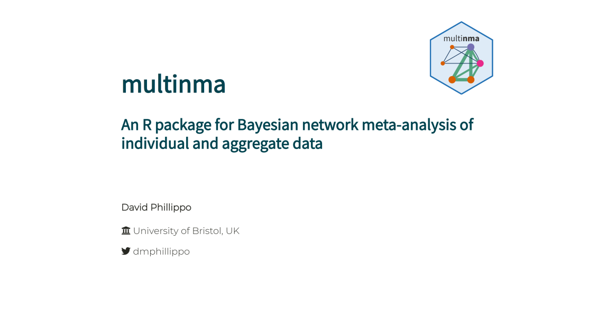

# multinma: An R package for Bayesian network meta-analysis of individual and aggregate data

*David Phillippo, University of Bristol*

Talk given at [ESMARConf 2021](https://www.eshackathon.org/events/2021-01-ESMAR.html), on 21st January 2021.

View slides [here](https://dmphillippo.github.io/ESMARConf2021_multinma).

### Abstract
Network meta-analysis (NMA) extends pairwise meta-analysis to synthesise evidence on multiple treatments of interest from a connected network of studies. 
Standard pairwise and network meta-analysis methods combine aggregate data from multiple studies, assuming that any factors that interact with treatment effects (effect modifiers) are balanced across populations. 
Population adjustment methods aim to relax this assumption by adjusting for differences in effect modifiers. 
The "gold standard" approach is to analyse individual patient data (IPD) from every study in a meta-regression model; however, such levels of data availability are rare. 
Multilevel network meta-regression (ML-NMR) is a recent method that generalises NMA to synthesise evidence from a mixture of IPD and aggregate data studies, whilst avoiding aggregation bias and non-collapsibility bias, and can produce estimates relevant to a decision target population. 

We introduce a new R package, multinma: a suite of tools for performing ML-NMR and NMA with IPD, aggregate data, or mixtures of both, for a range of outcome types. 
The package includes functions that streamline the setup of NMA and ML-NMR models; perform model fitting and facilitate diagnostics; produce posterior summaries of relative effects, rankings, and absolute predictions; and create flexible graphical outputs that leverage ggplot and ggdist.
Models are estimated in a Bayesian framework using the state-of-the art Stan sampler.

### Recording
A recording is available on [YouTube](https://t.co/vdMPQSEROj?amp=1).
