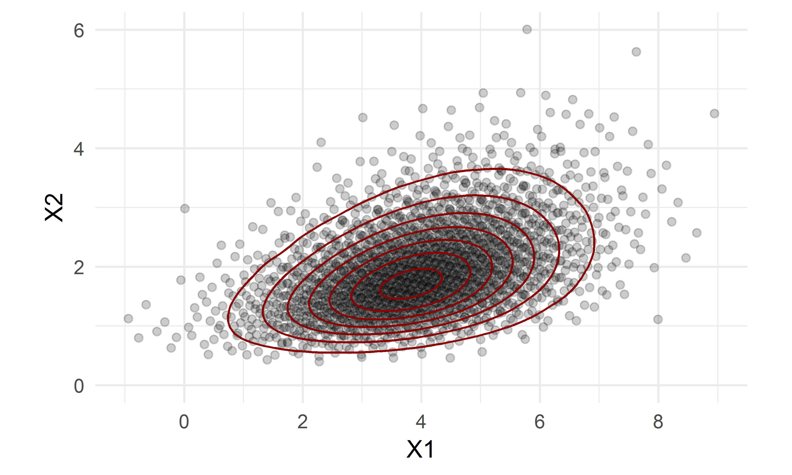

class: left, middle

```{r setup, include=FALSE}
options(htmltools.dir.version = FALSE, width = 65L, crayon.enabled = TRUE)
fansi::set_knit_hooks(hooks = knitr::knit_hooks)
knitr::opts_chunk$set(dev = "ragg_png", dpi = 300, fig.retina = 2, fig.width = 8, fig.height = 6)

library(ggraph)
library(dplyr)
library(multinma)
options(mc.cores = parallel::detectCores())
```

```{r xaringan-tile-view, echo=FALSE}
xaringanExtra::use_tile_view()
```

```{r xaringan-tachyons, echo=FALSE}
xaringanExtra::use_tachyons()
```

```{r xaringan-webcam, echo=FALSE}
# xaringanExtra::use_webcam(width = 300, height = 255)
```

```{r xaringan-hover, echo=FALSE}
xaringanExtra::use_extra_styles(hover_code_line = TRUE,
                                mute_unhighlighted_code = FALSE)
```

```{r xaringan-themer, include=FALSE, warning=FALSE}
library(xaringanthemer)
.base_colour <- "#00434F"
style_mono_accent(
  base_color = .base_colour,
  header_font_google = google_font("Source Sans Pro"),
  text_font_google   = google_font("Montserrat", "300", "300i"),
  code_font_google   = google_font("Fira Mono")
)
```

```{css echo=FALSE}
/* Hide slide numbers */
.remark-slide-number {
  display: none;
}

/* Add equal 3-column layout */
.c3left {
  width: 33.333%;
  float: left;
}
.c3center {
  width: 33.333%;
  display: inline-block;
}
.c3right {
  width: 33.333%;
  float: right;
}

/* Add 2:1 split columns */
.c2left {
  width: 66.666%;
  float: left;
}
.c2right {
  width: 33.333%;
  display: inline-block;
}

/* Highlight last item */
.highlight-last-item > ul > li, 
.highlight-last-item > ol > li {
  opacity: 0.5;
}
.highlight-last-item > ul > li:last-of-type,
.highlight-last-item > ol > li:last-of-type {
  opacity: 1;
}

/* Fix double-star bold */
strong {
  font-weight: bold;
  color: var(--text-bold-color);
}

/* Horizontal line before footnotes */
.footnote:first-of-type {
  border-top: 0.5px solid var(--text-color);
  margin-right: 4em;
  padding-right: 0px;
  padding-top: 0.5em;
}

/* Accent colour */
.accent {
  color: var(--text-bold-color);
}

/* Turn off slide shadow */
.remark-slide-scaler { 
  box-shadow: none;
} 

/* Add small header option */
.hsmall {
  font-family: var(--header-font-family);
  font-weight: 600;
  color: var(--header-color);
  font-size: 1.5rem;
  position: absolute;
  top: 0.75rem;
}
```

```{r metathis, echo=FALSE}
library(metathis)
meta() %>%
  meta_name("github-repo" = "dmphillippo/ESMARConf2021_multinma") %>% 
  meta_social(
    title = "multinma",
    description = paste(
      "An R package for Bayesian network meta-analysis of individual and aggregate data.",
      "Presented at ESMARConf 2021."
    ),
    url = "https://dmphillippo.github.io/ESMARConf2021_multinma",
    image = "https://dmphillippo.github.io/ESMARConf2021_multinma/share-card.png",
    image_alt = paste(
      "Title slide of multinma:", 
      "An R package for Bayesian network meta-analysis of individual and aggregate data,", 
      "presented at ESMARConf 2021 by David Phillippo"
    ),
    og_type = "website",
    og_author = "David Phillippo",
    twitter_card_type = "summary_large_image",
    twitter_creator = "@dmphillippo"
  )
```


# multinma
### An R package for Bayesian network meta-analysis of individual and aggregate data

<br><br>

#### David Phillippo

`r icon::fontawesome$solid$university` University of Bristol, UK

`r icon::fontawesome$brands$twitter` dmphillippo

---

## NMA and population adjustment

.c2left[
Standard (network) meta-analysis and indirect comparison methods
* Synthesise published aggregate data (AgD)
* Assume **constancy of relative effects**
$$d_{AB(AB)} = d_{AB(AC)}$$
]
.c2right[.center[
```{r ic-network, echo = FALSE, dev="svg", message = FALSE, pointsize = 24, fig.height = 2, fig.width = 2, fig.retina = 1}
ggraph(
  tidygraph::as_tbl_graph(
    tibble::tribble(~from, ~to, ~type,
                    "A", "B", "direct",
                    "A", "C", "direct",
                    "B", "C", "indirect",)
  ), layout = "circle") +
  geom_edge_link(aes(linetype = type), edge_width = 1) +
  geom_node_point(shape = 16, size = 10, colour = .base_colour) +
  geom_node_text(aes(label = name), colour = "white") +
  coord_equal(clip = "off") +
  theme_graph("Source Sans Pro") +
  theme(legend.position = "none",
        plot.margin = margin(0.75, 0.75, 0.75, 0.75, "lines"))
```
]]

`r icon::fontawesome("arrow-right")` Biased if there are differences in **effect modifiers** between studies

--

<br>
**Population adjustment** methods aim to relax this assumption using available individual patient data (IPD) to adjust for differences in effect modifiers between studies 

* Ideally, we would have IPD from every study (IPD network meta-regression)
* More typically we only have IPD from a subset

---

## Multilevel network meta-regression<br>(ML-NMR)

.footnote[Phillippo et al. (2020) Multilevel Network Meta-Regression for population-adjusted treatment comparisons. *J R Stat Soc: A*, 183(3):1189-1210. [DOI: 10.1111/rssa.12579](https://doi.org/10.1111/rssa.12579)]

Extends the NMA framework to synthesise mixtures of IPD and AgD and perform population adjustment in networks of any size

--

.c2left[
1\. Define an individual-level regression model 

  * IPD network meta-regression
]
.c2right.nt3[.center[
```{r, echo = FALSE, dev="svg", message = FALSE, pointsize = 12, fig.height = 2.5, fig.width = 2.5, fig.retina = 1, out.width=125}
set_agd_arm(thrombolytics, study = studyn, trt = trtn, r = r, n = n) %>% 
  tidygraph::as_tbl_graph() %>% 
  ggraph(layout = "linear", circular = TRUE) +
  geom_edge_link(edge_width = 1) +
  geom_node_point(shape = 16, size = 10, colour = .base_colour) + 
  # geom_node_text(aes(label = name), colour = "white") +
  coord_equal(clip = "off") +
  theme_graph("Source Sans Pro") +
  theme(plot.margin = margin(0.75, 0.75, 0.75, 0.75, "lines"))
```
]]

--

.flex[
.c2left.nt3[
2\. Average (integrate) this over the aggregate study populations to form the aggregate-level model

  * Use efficient and general numerical integration
]
.c2right.nt3[]
]

---
class: middle, inverse

# The {multinma} package

---

## The multinma package

.bg-washed-green.b--dark-green.ba.bw1.br3.ph3[
A suite of tools for performing ML-NMR and NMA with IPD, AgD, or mixtures of both, for a range of outcome types
]

--

<br>
The package includes functions that
  * Streamline the setup of NMA and ML-NMR models
  * Perform model fitting and facilitate diagnostics
  * Produce posterior summaries of relative effects, rankings, and absolute predictions
  * Create flexible graphical outputs that leverage `ggplot` and `ggdist`

--

<br>
Models are estimated in a Bayesian framework using *Stan*
  * Precompiled on CRAN (no user C++ toolchain / Rtools required)

---

## Outline of NMA in multinma

1\. Data in long ("tidy") format
  * One row per arm/contrast per AgD study, or per individual in IPD

--

2\. Define the network
  * `set_agd_arm()` &emsp; `set_agd_contrast()` &emsp; `set_ipd()`
  * `combine_network()`

--

3\. Specify prior distributions, run analysis
  * `nma()`
  * Fixed and random effects, UME inconsistency models, regression, ...

--

4\. Check convergence, model fit, results
  * `print()` &emsp; `plot()` &emsp; `plot_prior_posterior()` &emsp; `dic()`
  * `relative_effects()` &emsp; `predict()` &emsp; `posterior_ranks()`

---

## Outline of ML-NMR in multinma
.o-50[
1\. Data in long ("tidy") format
  * One row per arm/contrast per AgD study, or per individual in IPD

2\. Define the network
  * `set_agd_arm()` &emsp; `set_agd_contrast()` &emsp; `set_ipd()`
  * `combine_network()`
  ]

.bg-washed-green.b--dark-green.ba.bw1.br3.nl3.ph3[
3\. Set up numerical integration
  * `add_integration()` &emsp; `distr()`
]

.o-50[
4\. Specify prior distributions, run analysis
  * `nma()`
  * Fixed and random effects, UME inconsistency models, regression, ...

5\. Check convergence, model fit, results
  * `print()` &emsp; `plot()` &emsp; `plot_prior_posterior()` &emsp; `dic()`
  * `relative_effects()` &emsp; `predict()` &emsp; `posterior_ranks()`
]

---
class: middle, inverse

# Example
## Plaque Psoriasis ML-NMR

---

.hsmall[Tidy data]<p style="margin: 0pt;height: 0.5rem;"></p>

```{r, include = FALSE}
pso_ipd <- filter(plaque_psoriasis_ipd,
                  studyc %in% c("UNCOVER-1", "UNCOVER-2", "UNCOVER-3")) %>% 
  mutate(# Variable transformations
         bsa = bsa / 100,
         prevsys = as.numeric(prevsys),
         psa = as.numeric(psa),
         weight = weight / 10,
         durnpso = durnpso / 10,
         # Treatment classes
         trtclass = case_when(trtn == 1 ~ "Placebo",
                              trtn %in% c(2, 3, 5, 6) ~ "IL blocker",
                              trtn == 4 ~ "TNFa blocker"),
         # Check complete cases for covariates of interest
         complete = complete.cases(durnpso, prevsys, bsa, weight, psa)
  ) %>% 
  filter(complete)

pso_agd <- filter(plaque_psoriasis_agd,
                  studyc == "FIXTURE") %>% 
  mutate(
    # Variable transformations
    bsa_mean = bsa_mean / 100,
    bsa_sd = bsa_sd / 100,
    prevsys = prevsys / 100,
    psa = psa / 100,
    weight_mean = weight_mean / 10,
    weight_sd = weight_sd / 10,
    durnpso_mean = durnpso_mean / 10,
    durnpso_sd = durnpso_sd / 10,
    # Treatment classes
    trtclass = case_when(trtn == 1 ~ "Placebo",
                              trtn %in% c(2, 3, 5, 6) ~ "IL blocker",
                              trtn == 4 ~ "TNFa blocker")
  )
```

```{r, eval=FALSE}
pso_agd
```
```{r, echo=FALSE}
select(pso_agd, studyc, trtc, trtclass, pasi75_r, pasi75_n, 
       starts_with("durnpso"), starts_with("weight"), starts_with("bsa"), "prevsys", "psa") %>% 
  as_tibble()
```

--

```{r, eval=FALSE}
pso_ipd
```
```{r, echo=FALSE}
select(pso_ipd, studyc, trtc, trtclass, pasi75,
       durnpso, weight, bsa, prevsys, psa) %>% 
  as_tibble()
```

---

.hsmall[Network setup]<p style="margin: 0pt;height: 0.5rem;"></p>

```{r}
pso_net <- combine_network(
  set_ipd(pso_ipd, study = studyc, trt = trtc, 
          r = pasi75,
          trt_class = trtclass),
  set_agd_arm(pso_agd, study = studyc, trt = trtc, 
              r = pasi75_r, n = pasi75_n,
              trt_class = trtclass)
)
pso_net
```

---

.hsmall[Network plot]<p style="margin: 0pt;height: 0.5rem;"></p>

```{r pso_network_plot, fig.width=10, fig.height=6}
plot(pso_net, 
     weight_nodes = TRUE, 
     weight_edges = TRUE, 
     show_trt_class = TRUE)
```

---

.hsmall[Adding numerical integration]<p style="margin: 0pt;height: 0.5rem;"></p>

```{r}
pso_net <- add_integration(pso_net,
  durnpso = distr(qgamma, mean = durnpso_mean, sd = durnpso_sd),
  prevsys = distr(qbern, prob = prevsys),
  bsa     = distr(qlogitnorm, mean = bsa_mean, sd = bsa_sd),
  weight  = distr(qgamma, mean = weight_mean, sd = weight_sd),
  psa     = distr(qbern, prob = psa),
  n_int = 1000
)
```

---

.hsmall[Model fitting]<p style="margin: 0pt;height: 0.5rem;"></p>

```{r, eval=FALSE}
pso_fit_FE <- 
  nma(pso_net, 
      # FE model
      trt_effects = "fixed",
      # Probit link
      link = "probit", 
      # Regression
      regression = ~(durnpso + prevsys + bsa + weight + psa)*.trt,
      #Priors
      prior_intercept = normal(scale = 10),
      prior_trt = normal(scale = 10),
      prior_reg = normal(scale = 10))
```
```{r pso_fit_FE, echo=FALSE, cache=TRUE}
pso_fit_FE <- 
  nma(pso_net, 
      trt_effects = "fixed",
      link = "probit", 
      likelihood = "bernoulli2",
      regression = ~(durnpso + prevsys + bsa + weight + psa)*.trt,
      class_interactions = "common",
      prior_intercept = normal(scale = 10),
      prior_trt = normal(scale = 10),
      prior_reg = normal(scale = 10),
      init_r = 0.1,
      QR = TRUE)
```

---

.hsmall[Results]<p style="margin: 0pt;height: 0.5rem;"></p>

```{r, eval=FALSE}
print(pso_fit_FE)
```
```
## A fixed effects ML-NMR with a bernoulli2 likelihood (probit link).
## Regression model: ~(durnpso + prevsys + bsa + weight + psa) * .trt.
##
## Centred covariates at the following overall mean values:
##   durnpso   prevsys       bsa    weight       psa 
## 1.8259772 0.6495432 0.2917678 8.9328063 0.2172823 
##
## Inference for Stan model: binomial_2par.
## 4 chains, each with iter=2000; warmup=1000; thin=1; 
## post-warmup draws per chain=1000, total post-warmup draws=4000.
## 
##                mean se_mean   sd  2.5%   25%   50%  75% 97.5% n_eff Rhat
## beta[bsa]     -0.06    0.01 0.44 -0.98 -0.35 -0.05 0.25  0.77  4622    1
##   ...
## beta[bsa:aTNF] 0.05    0.01 0.53 -0.94 -0.32  0.03 0.39  1.09  5010    1
## beta[bsa:aIL]  0.28    0.01 0.49 -0.65 -0.04  0.27 0.61  1.29  5656    1
##   ...
## d[ETN]         1.55    0.00 0.08  1.40  1.50  1.55 1.61  1.71  4276    1
## d[IXE_Q2W]     2.96    0.00 0.09  2.80  2.90  2.95 3.02  3.13  4427    1
## d[IXE_Q4W]     2.54    0.00 0.08  2.39  2.49  2.54 2.60  2.71  4757    1
## d[SEC_150]     2.15    0.00 0.11  1.93  2.07  2.14 2.22  2.37  5465    1
## d[SEC_300]     2.45    0.00 0.12  2.22  2.37  2.45 2.53  2.69  7170    1
## 
```

---

.hsmall[Plots of model parameters]<p style="margin: 0pt;height: 0.5rem;"></p>

```{r, fig.width = 8, fig.height = 5}
plot(pso_fit_FE,
     pars = c("d", "beta"),
     stat = "halfeye",
     ref_line = 0)
```

---

.hsmall[Population-average relative effects]<p style="margin: 0pt;height: 0.5rem;"></p>

```{r, include = FALSE}
new_agd_means <- tibble(
  bsa = 0.6,
  prevsys = 0.1,
  psa = 0.2,
  weight = 10,
  durnpso = 3)

new_agd_int <- tibble(
  bsa_mean = 0.6,
  bsa_sd = 0.3,
  prevsys = 0.1,
  psa = 0.2,
  weight_mean = 10,
  weight_sd = 1,
  durnpso_mean = 3,
  durnpso_sd = 1
) %>% 
  add_integration(
  durnpso = distr(qgamma, mean = durnpso_mean, sd = durnpso_sd),
  prevsys = distr(qbern, prob = prevsys),
  bsa = distr(qlogitnorm, mean = bsa_mean, sd = bsa_sd),
  weight = distr(qgamma, mean = weight_mean, sd = weight_sd),
  psa = distr(qbern, prob = psa),
  cor = pso_net$int_cor,
  n_int = 1000)
```

```{r, results="hide"}
(pso_releff_FE <- relative_effects(pso_fit_FE, 
                                   newdata = new_agd_means))
```
```
## --------------------------------------------------- Study: New 1 ---- 
## Covariate values:
##  durnpso prevsys bsa weight psa
##        3     0.1 0.6     10 0.2
## 
##                   mean   sd 2.5%  25%  50%  75% 97.5% Bulk_ESS
## d[New 1: ETN]     1.25 0.23 0.81 1.10 1.25 1.40  1.72     6040
## d[New 1: IXE_Q2W] 2.89 0.22 2.46 2.74 2.89 3.03  3.34     6894
## d[New 1: IXE_Q4W] 2.47 0.22 2.04 2.33 2.47 2.62  2.92     7020
## d[New 1: SEC_150] 2.08 0.22 1.65 1.93 2.07 2.22  2.52     7082
## d[New 1: SEC_300] 2.39 0.22 1.94 2.24 2.38 2.53  2.84     7335
```

```{r pso_releff_FE_new, fig.width = 8, fig.height = 1.9}
plot(pso_releff_FE, ref_line = 0)
```

---

.hsmall[Population-average predicted probabilities]<p style="margin: 0pt;height: 0.5rem;"></p>

```{r, results="hide"}
(pso_pred_FE <- predict(pso_fit_FE, 
                        type = "response",
                        newdata = new_agd_int,
                        baseline = distr(qnorm, -1.75, 0.08)))
```
```
## --------------------------------------------------- Study: New 1 ---- 
## 
##                      mean   sd 2.5%  25%  50%  75% 97.5% Bulk_ESS
## pred[New 1: PBO]     0.06 0.02 0.03 0.04 0.06 0.08  0.12     5244
## pred[New 1: ETN]     0.37 0.06 0.26 0.33 0.37 0.40  0.49     6711
## pred[New 1: IXE_Q2W] 0.90 0.03 0.84 0.88 0.90 0.92  0.94     5593
## pred[New 1: IXE_Q4W] 0.80 0.04 0.73 0.78 0.81 0.83  0.87     5957
## pred[New 1: SEC_150] 0.68 0.05 0.57 0.64 0.68 0.72  0.79     5905
## pred[New 1: SEC_300] 0.78 0.05 0.68 0.75 0.78 0.81  0.86     5968
```

```{r pso_pred_FE_new, fig.width = 8, fig.height = 1.9}
plot(pso_pred_FE, ref_line = c(0, 1))
```

---

.hsmall[And more...]<p style="margin: 0pt;height: 0.5rem;"></p>

```{r pso_cumrankprobs_FE, fig.width = 8, fig.height = 3}
pso_cumrankprobs_FE <- 
  posterior_rank_probs(pso_fit_FE, newdata = new_agd_means,
                       lower_better = FALSE, cumulative = TRUE)
plot(pso_cumrankprobs_FE)
```

---

.hsmall[And more...]<p style="margin: 0pt;height: 0.5rem;"></p>

```{r}
dic(pso_fit_FE)
```


```{r, include=FALSE, cache=TRUE}
smknet <- set_agd_arm(smoking, 
                      study = studyn,
                      trt = trtc,
                      r = r, 
                      n = n,
                      trt_ref = "No intervention")

smkfit <- nma(smknet, 
              trt_effects = "random",
              prior_intercept = normal(scale = 100),
              prior_trt = normal(scale = 100),
              prior_het = normal(scale = 5))

smkfit_ume <- nma(smknet, 
                  consistency = "ume",
                  trt_effects = "random",
                  prior_intercept = normal(scale = 100),
                  prior_trt = normal(scale = 100),
                  prior_het = normal(scale = 5))

dic_re <- dic(smkfit)
dic_ume <- dic(smkfit_ume)
```


```{r, smk_devdev, fig.width=5, fig.height=4, out.width="50%", fig.show="hold"}
# Smoking cessation example
plot(dic_re)
plot(dic_re, dic_ume, 
     interval_alpha = 0.05)
```

---
class: middle, inverse

# Further details

---

exclude: true

## Future plans

The multinma package is under active development. Plans for future releases include:
.pull-left.nt3[
* Survival/time-to-event outcomes
* Competing risks
* Node splitting
* Handling disconnected networks/single-arm studies
* Exchangeable interactions
]
.pull-right.nt3[
* Class effects models
* Unequal heterogeneity variances between contrasts
* Regression on baseline risk
* Predictive distributions
]

Interface with other packages:
.flex[
.pull-left.nt3[
* bayesplot, shinystan .dark-green[✔]
* rstan, loo .dark-green[✔]
* tidybayes, ggdist .dark-green[✔]
]
.pull-right.nt3[
* posterior, coda, tidymeta
* gemtc
* nmathresh
]
]
---

## Further details

Package website: **[dmphillippo.github.io/multinma](https://dmphillippo.github.io/multinma)**

* Illustrated documentation
* Detailed walkthroughs of example analyses (vignettes)

Paper:
.ml3[
Phillippo et al. (2020) Multilevel Network Meta-Regression for population-adjusted treatment comparisons. *J R Stat Soc: A*, 183(3):1189-1210. [DOI: 10.1111/rssa.12579](https://doi.org/10.1111/rssa.12579)
]

Contribute:
.ml3[
`r icon::fontawesome("github")` [dmphillippo/multinma](https://github.com/dmphillippo/multinma)
]

.center.mt10[
### Thank you

**`r icon::fontawesome$brands$twitter` dmphillippo**
]
